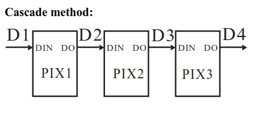
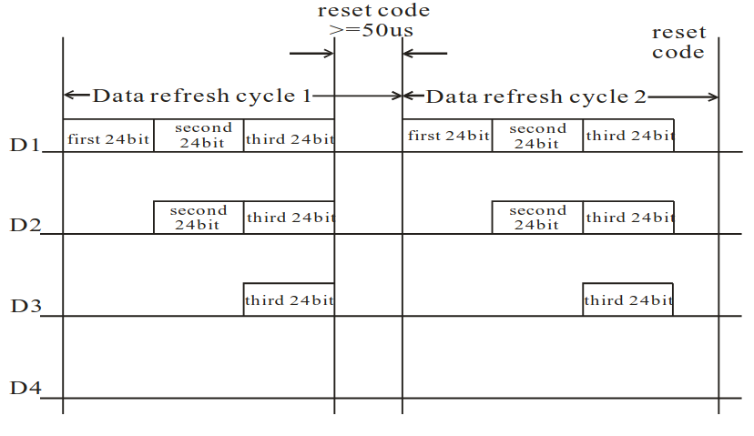
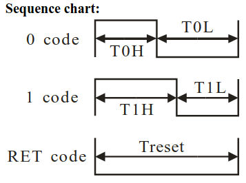
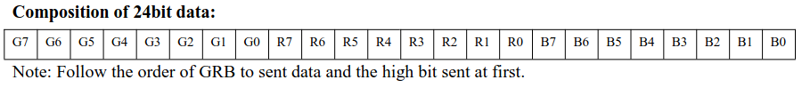

# EngEmil WS2812B ChibiOS Driver

EngEmil WS2812B ChibiOS Driver is developed for the WS2812B RGB LED Module(s) and is written in C with C++ wrap.


## Extracting useful information from WS2812B Data Sheet

Link (from Sparkfun): https://cdn.sparkfun.com/assets/e/6/1/f/4/WS2812B-LED-datasheet.pdf

- The WS2812B is controlled over a non-standard protocol known as a one-wire protocol/interface.
- WS2812B is designed to work in cascade, aka. a chain/series of WS2812B connected together.

    

- The data transmitted over the one-wire protocol allows for controlling all the WS2812B connected in the chain/series.
    - Data is sent as 1's and 0's with respect to timing.
    - The WS2812Bs are updated within a data cycle.
        - A data cycle should be 24-bits multiplied with n number of WS2812Bs.
            - Where each 24-bits are for different WS27812Bs on the chain/series. This is incremental from the first in chain/series.
        - A new data cycle happens when a reset code is sent. A reset code is when no data transmitted for 50 microseconds or longer (`>= 50u`).
        - When a reset code is sent, the next data cycle starts over with the first WS2812B in the chain/series.
    
    

    - 0's are defined as: Signal high for 0.4us +/- 0.15us and low for 0.85us +/- 0.15us
    - 1's are defined as: SIgnal high for 0.85us +/- 0.15us and low for 0.4us +/- 0.15us
    - Note that 0's and 1's will have a data tansfer time of 1.25us +/- 0.3us (data sheet says 1.25us +/- 0.6us)
    - Reset code is defined as: Signal low for 50us or more

    

    - For each 24-bit we will configure one WS2812B.
        - By dividing 24-bits into 3, gives us 8-bits, which corresponds to the defined resolution of each LED (Red, Green, Blue) on a single WS2812B.
        - The composition of the 24-bits are divided into GRB (Green, Red, Blue).
        - The first bit transmitted is the most significant bit (MSB).

    


- Trivial information for one-wire protocol
    - Normally you need additional pull-up resistor. Use STM32-pins internal pull-up resistor (programmetically).


## Configure ChibiOS to be used with Driver

Since this driver will be built on top of the ChibiOS framework, we can simply the driver by building it on top of the ChibiOS PWM Driver with DMA.


- Configure `halconf.h`-file:
    ```
    #define HAL_USE_PWM                 TRUE
    ```
- Configure `mcuconf.h`-file. Example, if we want to use PXX on STM32C071RB:
    ```
    #define STM32_PWM_USE_TIM4                  TRUE
    ```

